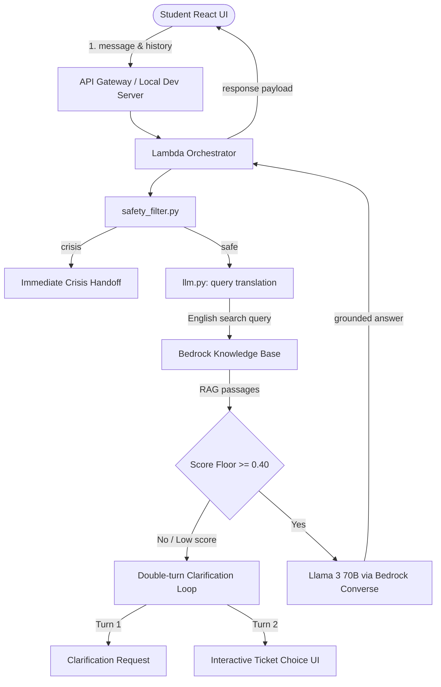

# CSUCI Student Success Navigator

An AI-powered assistant designed to help California State University Channel Islands (CSUCI) students, families, and prospective students find accurate campus answers regarding registration, advising, financial aid, tutoring, and campus locations.

The project features a **React Vite frontend** integrated alongside a serverless **Python AWS backend** (Amazon Bedrock RAG and Llama 3 70B).

---

## System Architecture



### Component Summary

| Component | Purpose |
|---|---|
| **React Frontend** | Modern, responsive student chat interface with interactive support ticket generation options. |
| **Lambda Orchestrator** | Coordinates safety filter → query translation → RAG retrieval → history pruning → LLM answer generation. |
| **Safety Filter** | Scans messages for crisis language and handles direct human handoff requests. |
| **RAG Translation** | Pre-processes foreign language questions (e.g. Spanish) by translating them to English before querying the vector base, ensuring maximum match quality. |
| **Bedrock Knowledge Base** | Vector storage database containing scraped CSUCI websites, roadmaps, and catalogs. |
| **Llama 3 70B Model** | Generates encouragement-toned, counselor-style responses and automatically matches the input language. |

---

## Key Features

*   **Interactive Ticket Generation**: If the bot is unable to answer a query after a clarification turn, it displays direct contact details for the specialized office and offers buttons to generate an official support ticket. Accepting generates a unique tracking ID (`#CSUCI-XXXXXX`) and a counselor-assigned summary badge.
*   **Cross-Lingual RAG Translation**: Resolves low match scores on foreign queries (e.g. Spanish) by pre-translating the search query to English. It retrieves matching English documents and passes them to Llama 3, which translates the facts back to reply fully in the student's language.
*   **Context & Token Safeguards**:
    *   *Sliding History Window*: Prunes history to the last 10 turns (5 user-bot exchanges) to stay safely within Llama's 8,192 token limit.
    *   *Passage Clipping*: Truncates retrieved text blocks to `2,500` characters to filter out web scraper headers and footers.
    *   *Minimal Retrieval footprint*: Retrieves `top_k=3` passages for lightweight queries.
*   **Raised Score Floor Guardrail**: Employs a strict `0.40` score threshold to immediately route out-of-scope or irrelevant queries into the double-turn clarification loop.

---

## Local Development Setup

To run the Student Success Navigator application locally, you will run the backend Python server and the React frontend concurrently.

### 1. Configure the Environment
Create a `.env` file in the root of the project and paste your AWS credentials and configuration:
```env
# Bedrock Knowledge Base ID
BEDROCK_KB_ID=XEAFKVXLTI

# Bedrock model identifier
MODEL_ID=meta.llama3-70b-instruct-v1:0

# AWS credentials (for local developer access)
AWS_REGION=us-west-2
AWS_ACCESS_KEY_ID=ASIA...
AWS_SECRET_ACCESS_KEY=...
AWS_SESSION_TOKEN=IQoJb3Jp...
```
> **Security Note:** Never commit your `.env` file to git. It is automatically blocked by `.gitignore`.

### 2. Start the Backend Dev Server
Open a terminal in the project root folder:
```bash
# Activate your python virtual environment
source venv/bin/activate

# Start the local API server (runs on http://localhost:8000)
python scratch/dev_server.py
```

### 3. Start the Frontend Dev Server
Open a **new terminal window** in the project root folder:
```bash
# Navigate to the frontend directory
cd frontend

# Install npm dependencies (if not done already)
npm install

# Start the Vite React server (runs on http://localhost:5173)
npm run dev
```
Open your browser to [http://localhost:5173](http://localhost:5173) to interact with the bot!

---

## Run Unit Tests

The backend includes a comprehensive test suite of 44 assertions covering safety keywords, double-turn failure loops, pre-processing, and router scoring.

To run the tests locally:
```bash
source venv/bin/activate
pytest tests/ -v
```

---

## Project Structure

```
CSUCI Student Success Navigation/
├── README.md                  ← you are here
├── .env.example
├── requirements.txt           ← Backend dependencies
├── lambda/
│   └── orchestrator/
│       ├── handler.py         ← Lambda Orchestrator entry pipeline
│       ├── safety_filter.py   ← Crisis and escalation regex filter
│       ├── retriever.py       ← Bedrock Knowledge Base retrieval client
│       ├── llm.py             ← Converse API caller, translation, & history pruning
│       ├── router.py          ← Keyword-matching department routing & ticket draft
│       └── prompts.py         ← Counselor prompts and constraints
├── tests/
│   ├── test_handler.py
│   ├── test_retriever.py
│   └── test_safety_filter.py
├── frontend/                  ← Vite React frontend application
│   ├── src/
│   │   ├── App.jsx            ← Interactive UI and ticket choice cards
│   │   └── index.css          ← Premium layout CSS
│   └── package.json
└── docs/
    ├── api_reference.md
    └── architecture.md
```

---

## Team & License

*   **License**: Developed for CSUCI coursework. See `LICENSE` for details.
