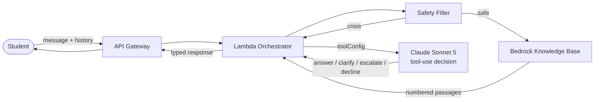

# CSUCI Student Success Navigator

An AI-powered chatbot that helps California State University Channel Islands (CSUCI) students get instant, accurate answers to questions about registration, advising, financial aid, graduation, and campus support services.

Built on **Amazon Bedrock** (Claude Sonnet 5 + Knowledge Bases) with a fully serverless AWS backend and a React frontend. On every turn the model makes a **structured decision** via Converse tool-use — answer, ask a clarifying question, escalate to a specific campus office, or decline — instead of emitting text that code has to parse.

---

## Architecture



### Component Summary

| Component | Purpose |
|---|---|
| **API Gateway** | HTTPS endpoint with CORS; routes `POST /chat` to Lambda |
| **Lambda Orchestrator** | Safety check → retrieval → tool-use decision → typed response |
| **Safety Filter** | Deterministic crisis detection (pre-LLM) + human-request backstop |
| **Bedrock Knowledge Base** | RAG retrieval over CSUCI catalog & policy documents |
| **Claude Sonnet 5** | Picks one of four tools (or answer+escalate pair); cites passages by number |
| **Office directory** (`router.py`) | Phone book: contact cards + staff tickets for the office the model picks |

Conversation history is client-managed (passed in each request); nothing is stored server-side. See **[docs/architecture.md](docs/architecture.md)** for the full design and **[docs/converse-tools-refactor-plan.md](docs/converse-tools-refactor-plan.md)** for the decision record behind it.

---

## Prerequisites

| Tool | Version |
|---|---|
| AWS Account | With Amazon Bedrock model access enabled |
| AWS SAM CLI | ≥ 1.100 |
| Python | 3.12 |
| Node.js | ≥ 18 (for the React frontend) |
| Docker | Optional, for `sam build --use-container` |

---

## Setup

### 1. Clone the repository

```bash
git clone <repo-url>
cd "CSUCI Student Success Navigation"
```

### 2. Configure environment

```bash
cp .env.example .env
# Edit .env and fill in:
#   BEDROCK_KB_ID  — your Knowledge Base ID
#   AWS_REGION     — e.g. us-west-2
```

### 3. Deploy the backend

```bash
cd infra
sam build
sam deploy --guided
# Follow the prompts — provide your BedrockKBId when asked.
```

> **Tip:** After the first guided deploy the settings are saved in `samconfig.toml`. Future deploys only need `sam deploy`.

### 4. Note the outputs

After deployment, SAM prints:

```
Outputs:
  ApiEndpointUrl   = https://xxxxxxxxxx.execute-api.us-west-2.amazonaws.com/prod/chat
  SessionTableName = student-navigator-sessions-dev
  OrchestratorFunctionArn = arn:aws:lambda:...
```

Use the `ApiEndpointUrl` in your frontend `.env` file.

### 5. Run the tests

```bash
pip install -r requirements-dev.txt   # pytest, moto, boto3, etc.
pytest tests/ -v
```

---

## API Reference (Quick)

### `POST /chat`

**Request:**
```json
{
  "message": "How do I register for classes?",
  "history": [],
  "sessionId": "optional-uuid"
}
```

**Response (200):**
```json
{
  "type": "answer",
  "message": "You can register via the myCI portal [1]...",
  "citations": [{ "title": "Registration Guide", "url": "https://...", "passages": [1] }],
  "sessionId": "uuid-of-session"
}
```

`type` is one of `answer | clarify | escalate | decline | crisis`; `escalation` (contact card + ticket draft) appears when a human handoff is involved.

For the full schema, error codes, and curl examples see **[docs/api_reference.md](docs/api_reference.md)**.

---

## Project Structure

```
CSUCI Student Success Navigation/
├── README.md                  ← you are here
├── .env.example
├── infra/
│   ├── template.yaml          ← AWS SAM / CloudFormation template
│   └── samconfig.toml         ← SAM CLI deployment defaults
├── lambda/
│   ├── orchestrator/
│   │   ├── handler.py         ← Lambda entry point: dispatch + policy
│   │   ├── tools.py           ← the four Converse tools (routing rules live here)
│   │   ├── prompts.py         ← thin system prompt + code-owned templates
│   │   ├── llm.py             ← Converse tool-use wrapper (the only Bedrock seam)
│   │   ├── retriever.py       ← Bedrock Knowledge Base retrieval
│   │   └── router.py          ← office phone book + ticket assembly
│   └── safety_filter.py       ← crisis & human-request detection
├── eval/
│   ├── golden_set.json        ← human answer key (outcome + office labels)
│   └── run_eval.py            ← live scorecard: accuracy + confusion matrix
├── tests/
│   ├── conftest.py            ← shared fixtures
│   ├── test_safety_filter.py
│   ├── test_retriever.py
│   ├── test_llm.py            ← Converse parsing + decision validation
│   ├── test_handler.py        ← dispatch, contract, fail-safe policy
│   └── fixtures/
│       └── sample_queries.json
├── frontend/                  ← React app (separate README)
└── docs/
    ├── api_reference.md
    ├── architecture.md
    └── converse-tools-refactor-plan.md
```

---

## Contributing

1. Create a feature branch from `main`.
2. Write tests for new behaviour.
3. Ensure `pytest tests/ -v` passes.
4. Open a pull request.

---

## Team

> _Add team member names and roles here._

---

## License

This project is developed for CSUCI coursework. See `LICENSE` for details.
