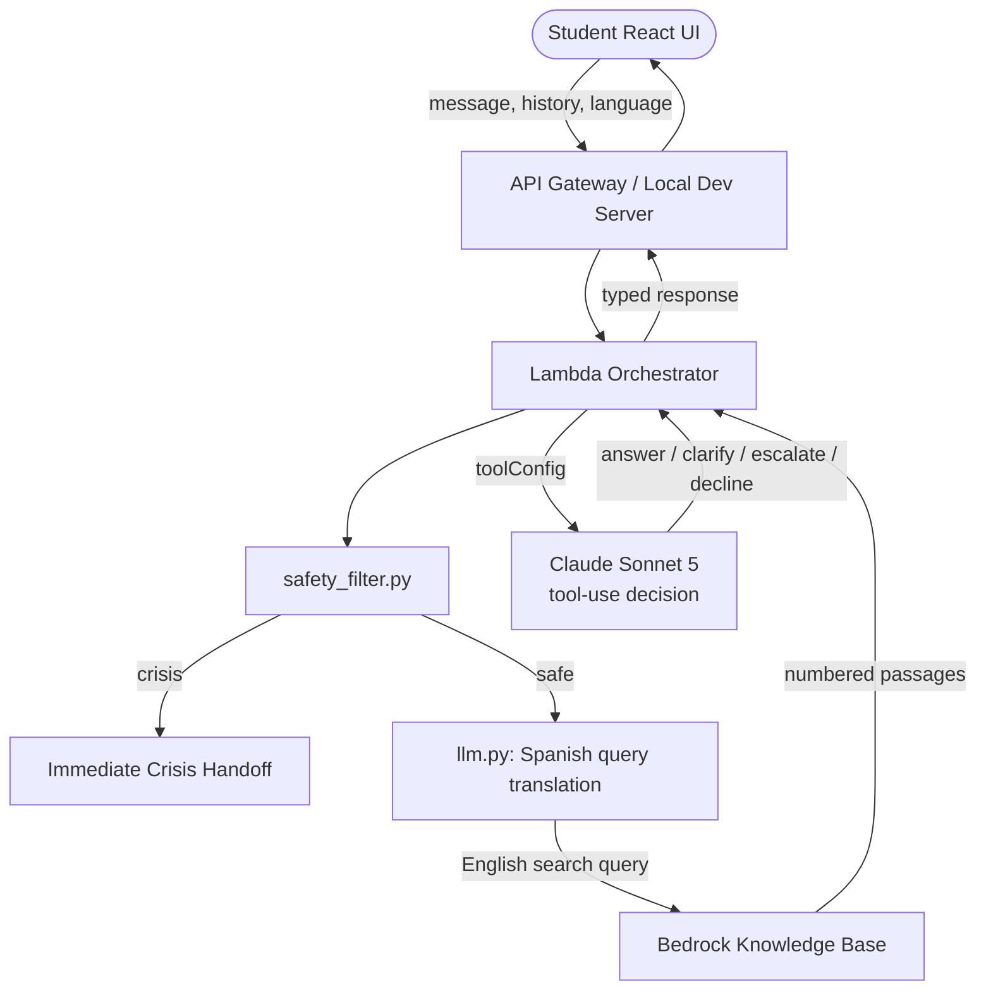

# CSUCI Student Success Navigator

An AI-powered assistant designed to help California State University Channel Islands (CSUCI) students, families, and prospective students find accurate campus answers regarding registration, advising, financial aid, tutoring, and campus locations.

Built with a **React Vite frontend** and a serverless **Python AWS backend** on **Amazon Bedrock** (Claude Sonnet 5 + Knowledge Bases). On every turn the model makes a **structured decision** via Converse tool-use — answer, ask a clarifying question, escalate to a specific campus office, or decline — instead of emitting text that code has to parse.

---

## System Architecture



### Component Summary

| Component | Purpose |
|---|---|
| **React Frontend** | Responsive chat UI: streaming replies, markdown rendering, language selector, interactive support-ticket generation |
| **Lambda Orchestrator** | Safety check → (Spanish) query translation → retrieval → tool-use decision → typed response |
| **Safety Filter** | Deterministic crisis detection (pre-LLM) + human-request backstop |
| **RAG Translation** | Pre-translates Spanish-mode questions to English before querying the vector base, for maximum match quality |
| **Bedrock Knowledge Base** | Vector storage over scraped CSUCI websites, roadmaps, and catalogs |
| **Claude Sonnet 5** | Picks one of four tools (or answer+escalate pair); cites passages by number |
| **Office directory** (`router.py`) | Phone book: contact cards + staff tickets for the office the model picks |

Conversation history is client-managed (passed in each request); nothing is stored server-side. See **[docs/architecture.md](docs/architecture.md)** for the full design and **[docs/converse-tools-refactor-plan.md](docs/converse-tools-refactor-plan.md)** for the decision record behind it.

---

## Key Features

*   **Structured tool-use decisions**: The model must call one of four tools (`answer_from_context`, `ask_clarification`, `escalate_to_office`, `decline_out_of_scope`) — no sentinel-string parsing. One pair is allowed: answer + escalate, for messages that are both answerable and need a human.
*   **Grounded citations**: Answers cite passages by number (`[1]`); the backend resolves numbers to trusted URLs from retrieved chunks. The model never writes a URL. Ungrounded answers fail safe to a human handoff.
*   **Interactive Ticket Generation**: Escalations display direct contact details for the specialized office and offer buttons to generate a support ticket with a unique tracking ID (`#CSUCI-XXXXXX`) and a staff-facing summary written by the model.
*   **Cross-Lingual Support**: Selecting 🇪🇸 ES pre-translates the search query to English (the KB is English) and forces fully-Spanish replies. In 🇺🇸 EN mode the assistant simply replies in whatever language the student writes.
*   **Streaming replies**: Responses reveal word-by-word for a live typing feel, with full markdown rendering (headings, bold, lists, citation links).
*   **Animated Mascot Engine**: Renders a frame-by-frame procedural pixel-art dolphin mascot animation on the landing interface that reacts to interaction states.

---

## Local Development Setup

Run the backend Python server and the React frontend concurrently.

### 1. Configure the Environment
Copy `.env.example` to `.env` in the project root and fill in your values:
```env
# Bedrock Knowledge Base ID
BEDROCK_KB_ID=XEAFKVXLTI

# Bedrock model identifier (tool-use-capable inference profile)
MODEL_ID=us.anthropic.claude-sonnet-5

# AWS region
AWS_REGION=us-west-2
```
AWS credentials come from your configured profile / SSO session (`aws sso login`).
> **Security Note:** Never commit your `.env` file to git. It is automatically blocked by `.gitignore`.

### 2. Start the Backend Dev Server
Open a terminal in the project root folder:
```bash
# Start the local API server (runs on http://localhost:8000)
python scratch/dev_server.py
```

### 3. Start the Frontend Dev Server
Open a **new terminal window** in the project root folder:
```bash
cd frontend
npm install     # if not done already
npm run dev     # runs on http://localhost:5173
```
Open your browser to [http://localhost:5173](http://localhost:5173) to interact with the bot!

---

## Run Unit Tests

The backend test suite covers safety keywords, Converse tool-call parsing and validation, dispatch policy, the response contract, fail-safe behavior, and language preferences.

```bash
pytest tests/ -v
```

There is also a **live eval** (needs AWS credentials): `python eval/run_eval.py` runs the golden set through the real stack and prints outcome/routing accuracy plus a confusion matrix. Compare against `eval/baseline_results.json` before merging prompt or tool-description changes.

---

## API Reference (Quick)

### `POST /chat`

**Request:**
```json
{
  "message": "How do I register for classes?",
  "history": [],
  "sessionId": "optional-uuid",
  "language": "en"
}
```

**Response (200):**
```json
{
  "type": "answer",
  "message": "You can register via the myCI portal [1]...",
  "citations": [{ "title": "Registration Guide", "url": "https://...", "passages": [1] }],
  "sessionId": "uuid-of-session"
}
```

`type` is one of `answer | clarify | escalate | decline | crisis`; `escalation` (contact card + ticket draft) appears when a human handoff is involved.

For the full schema, error codes, and curl examples see **[docs/api_reference.md](docs/api_reference.md)**.

---

## Project Structure

```
CSUCI Student Success Navigation/
├── README.md                  ← you are here
├── .env.example
├── requirements.txt           ← Backend dependencies
├── lambda/
│   ├── orchestrator/
│   │   ├── handler.py         ← Lambda entry point: dispatch + policy
│   │   ├── tools.py           ← the four Converse tools (routing rules live here)
│   │   ├── prompts.py         ← thin system prompt + code-owned templates
│   │   ├── llm.py             ← Converse tool-use wrapper + query translation
│   │   ├── retriever.py       ← Bedrock Knowledge Base retrieval
│   │   └── router.py          ← office phone book + ticket assembly
│   └── safety_filter.py       ← crisis & human-request detection
├── eval/
│   ├── golden_set.json        ← human answer key (outcome + office labels)
│   └── run_eval.py            ← live scorecard: accuracy + confusion matrix
├── tests/
│   ├── conftest.py            ← shared fixtures
│   ├── test_safety_filter.py
│   ├── test_retriever.py
│   ├── test_llm.py            ← Converse parsing + decision validation
│   ├── test_handler.py        ← dispatch, contract, fail-safe, language
│   └── fixtures/
│       └── sample_queries.json
├── frontend/                  ← Vite React frontend application
│   ├── src/
│   │   ├── App.jsx            ← composition root
│   │   ├── DolphinLoader.jsx  ← animated pixel-art dolphin mascot loader engine
│   │   ├── components/        ← ChatHome, AppHeader, ChatInput, ChatThread, MessageBubble, EscalationCard, FloatingBubble
│   │   ├── hooks/             ← useChat (core state + streaming API), useDraggable (window bubble dragging)
│   │   ├── utils/markdown.jsx ← custom markdown + [N] citation link resolver
│   │   └── config.js          ← centralized app settings & endpoint URLs
│   └── package.json
└── docs/
    ├── api_reference.md
    ├── architecture.md
    └── converse-tools-refactor-plan.md
```

---

## Team & License

*   **License**: Developed for CSUCI coursework. See `LICENSE` for details.
