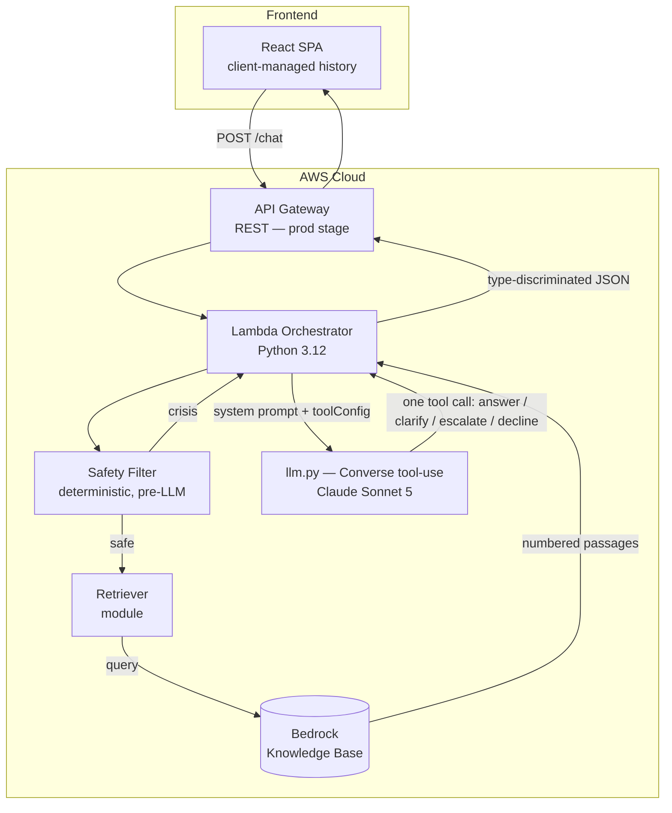

# Architecture — CSUCI Student Success Navigator

## Overview

The Student Success Navigator is a **Retrieval-Augmented Generation (RAG)**
chatbot that answers student questions using official CSUCI documents as the
ground truth. The system is fully serverless on AWS.

The core design: the LLM makes a **structured decision** on every turn by
calling exactly one Converse tool (or one allowed pair). There are no sentinel
strings to parse and no keyword routing — the model classifies, code renders.

---

## High-Level Architecture



---

## The decision layer (tool-use)

Instead of prose rules that the model may blend or violate, the model must
call one of four tools (`toolChoice: any` — free text alone is rejected):

| Tool | Meaning | Student sees |
|---|---|---|
| `answer_from_context(answer, citations[])` | Grounded answer; citations are **passage numbers** | The answer, with `[N]` links |
| `ask_clarification(question)` | Question is ambiguous | One clarifying question |
| `escalate_to_office(office, reason)` | CSUCI matter needing a human | Code-owned lead-in + contact card |
| `decline_out_of_scope(reason)` | Not a CSUCI matter | Code-owned standard decline |

**One allowed pair:** `answer_from_context` + `escalate_to_office`, for
messages that are both answerable and need a human ("How do I register?
Also connect me to an advisor."). Any other combination is rejected.

**Grounding backstop:** the model cites passages by number; code resolves
numbers to trusted `{title, url}` from the retrieved chunks. The model never
emits a URL. Empty or out-of-range citations mean the answer is ungrounded —
it is discarded and the turn fails safe to a human handoff.

**Fail-safe policy:** any structurally unusable model output (no tool, unknown
tool, disallowed combination, ungrounded answer) escalates to
`general_support` and is logged loudly. Bedrock/API errors return HTTP 500
(retryable) instead — infrastructure failure is not a reason to send a student
to an office.

**Backstop for explicit human requests:** the deterministic safety filter
detects "I want to talk to a person"; if the model didn't escalate on its own,
code forces an escalation card onto the response.

## Component Breakdown

### 1. API Gateway (REST)

- **Type:** AWS::Serverless::Api (SAM-managed), stage `prod`
- **CORS:** `*` origin, `POST`/`OPTIONS`
- **Integration:** Lambda proxy

### 2. Lambda Orchestrator (`lambda/orchestrator/`)

- **Runtime:** Python 3.12, 512 MB, 30 s timeout
- **Handler:** `handler.lambda_handler`

Per request:

1. Parse and validate the JSON body.
2. **Safety filter** (deterministic regex, pre-LLM): crisis → immediate canned
   response, LLM and retriever bypassed entirely.
3. **Retrieve** top-5 passages from the Bedrock KB — always; there is no
   score-floor short-circuit. Weak retrieval is handled by the grounding
   backstop, not by skipping the model.
4. Build the thin system prompt (numbered passages) + tool config; one
   Converse call.
5. Validate the tool decision (structure in `llm.py`, policy in `handler.py`)
   and dispatch into the response contract.
6. Structured JSON interaction log to CloudWatch.

Modules: `tools.py` (tool schemas — the routing rules live in the tool
descriptions), `prompts.py` (thin system prompt + code-owned student-facing
templates), `llm.py` (the only module that knows Converse exists),
`router.py` (office phone book + ticket assembly), `safety_filter.py`
(crisis/human-request regexes).

### 3. Safety Filter

Rule-based, pre-LLM. Crisis language returns a canned hotline response and
bypasses all AI processing. Human-request phrases ("talk to a person") set a
flag the handler uses as an escalation backstop.

### 4. Bedrock Knowledge Base (Retriever)

- **Service:** Amazon Bedrock Knowledge Bases (`bedrock-agent-runtime:Retrieve`)
- **Embedding model:** Amazon Titan Text Embeddings v2
- **Vector store:** OpenSearch Serverless (managed by Bedrock)
- Returns top-K chunks with relevance scores and source metadata; sidecar
  `.metadata.json` files supply real page URLs/titles.

### 5. LLM (Claude Sonnet 5)

- **Model ID:** `us.anthropic.claude-sonnet-5` — an **inference profile**
  (Claude models on Bedrock are inference-profile only; the bare model ID is
  rejected for on-demand use).
- **Invocation:** Bedrock **Converse** API with `toolConfig` and
  `toolChoice: {any}`.
- **Note:** Sonnet 5 rejects the `temperature` parameter (deprecated).
- Conversation history is **client-managed**: the frontend passes prior turns
  in the request; nothing is stored server-side.

---

## Response contract

See [api_reference.md](api_reference.md). Summary: every 200 response is
`{type, message, citations?, escalation?, sessionId, debug?}` where
`type ∈ {answer, clarify, escalate, decline, crisis}`. Clients render
`message`, then sidecars by presence. The legacy `answered` boolean is gone.

---

## Evaluation

`eval/single_turn_cases.json` is a human-written answer key (~31 cases) labeled with
the four-outcome taxonomy (`answerable` / `ambiguous` / `needs_human` /
`out_of_scope`, plus `crisis`) and expected offices. `eval/run_eval.py` runs
every case through the **live stack** and reports outcome accuracy, routing
accuracy, and a confusion matrix. It is a manual, opt-in scorecard (needs AWS
credentials), not part of the pytest suite. Run it before merging any change
to tool descriptions or the system prompt, and compare against
`eval/baseline_results.json`.

---

## Security Considerations

- **No PII stored server-side** — conversation history lives in the client.
- All traffic HTTPS; Lambda IAM follows least privilege (specific KB, model
  profile, SNS topic).
- Crisis content never reaches the LLM.
- The model cannot fabricate sources: URLs are resolved server-side from
  retrieved chunks only.

### Future Enhancements

- WAF / per-user rate limiting on API Gateway
- CSUCI SSO for authenticated sessions
- SNS wiring for real-time staff notification on escalations (topic exists in
  the SAM template; the handler does not publish to it yet)
- Server-side session persistence if history grows beyond client comfort

---

## Deployment

```bash
sam deploy --parameter-overrides Environment=prod BedrockKBId=YOUR_KB_ID
```

`MODEL_ID` is a template parameter; it must be a tool-use-capable Claude
inference profile. The Lambda IAM policy allows both the inference-profile ARN
and the underlying cross-region `anthropic.*` foundation-model ARNs.
