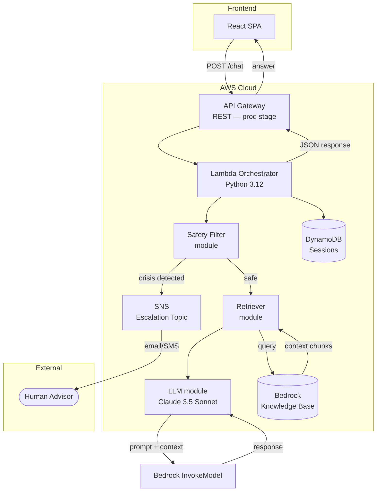

# Architecture — CSUCI Student Success Navigator

## Overview

The Student Success Navigator is a **Retrieval-Augmented Generation (RAG)** chatbot that answers student questions using official CSUCI documents as the ground truth. The system is fully serverless, running on AWS with no long-lived compute.

---

## High-Level Architecture



---

## Component Breakdown

### 1. API Gateway (REST)

- **Type:** AWS::Serverless::Api (SAM-managed)
- **Stage:** `prod`
- **CORS:** Allows `*` origin, `Content-Type` / `Authorization` headers, `POST` / `OPTIONS` methods
- **Integration:** Lambda proxy integration — the full HTTP request is forwarded to Lambda

**Why REST (not HTTP API)?** SAM's `Api` event type generates a REST API by default, and REST APIs offer richer features (request validation, usage plans, WAF integration) that will be useful in production.

### 2. Lambda Orchestrator

- **Runtime:** Python 3.12
- **Memory:** 512 MB
- **Timeout:** 30 seconds
- **Handler:** `handler.lambda_handler`

The orchestrator is the central coordinator. On each request it:

1. Parses and validates the incoming JSON body.
2. Calls the **Safety Filter** to check for crisis or escalation.
3. If safe, calls the **Retriever** to fetch relevant document chunks.
4. Passes the context + conversation history to the **LLM** for response generation.
5. Saves the turn to **DynamoDB**.
6. Returns the response.

**IAM Permissions:**

| Permission | Resource |
|---|---|
| `dynamodb:PutItem`, `GetItem`, `UpdateItem`, `DeleteItem`, `Query`, `Scan` | Session table |
| `bedrock:InvokeModel` | Claude 3.5 Sonnet foundation model |
| `bedrock:Retrieve` | Bedrock Knowledge Base |
| `sns:Publish` | Escalation SNS topic |

### 3. Safety Filter

A **rule-based** module (no ML required) that scans every incoming message for:

- **Crisis keywords:** suicide, self-harm, "want to die", "hurt myself", etc.
- **Escalation phrases:** "talk to a person", "need a human", "speak with advisor"

If a crisis is detected:
- A pre-defined crisis response with hotline numbers is returned immediately.
- The LLM and retriever are **bypassed** entirely (no risk of an inappropriate AI response).
- An SNS notification is published to alert staff.

If escalation is detected:
- A response with advisor contact information is returned.
- An SNS notification is published.

### 4. Bedrock Knowledge Base (Retriever)

- **Service:** Amazon Bedrock Knowledge Bases
- **Data sources:** CSUCI catalog PDFs, policy documents, advising guides
- **Embedding model:** Amazon Titan Text Embeddings v2
- **Vector store:** Amazon OpenSearch Serverless (managed by Bedrock)

The retriever calls `bedrock-agent-runtime:Retrieve` with the student's query and receives the top-K most relevant text chunks along with relevance scores and source document URIs.

### 5. LLM (Claude 3.5 Sonnet)

- **Model ID:** `anthropic.claude-3-5-sonnet-20241022-v2:0`
- **Invocation:** `bedrock:InvokeModel`

The LLM receives a structured prompt containing:
1. A **system message** defining the assistant's role and guardrails.
2. **Retrieved context** chunks from the Knowledge Base.
3. **Conversation history** (last N turns from DynamoDB).
4. The **current user message**.

The system prompt instructs Claude to:
- Only answer based on provided context.
- Cite sources.
- Politely decline questions outside CSUCI scope.
- Never provide medical, legal, or financial advice.

### 6. DynamoDB (Session Store)

- **Table name:** `student-navigator-sessions-{env}`
- **Partition key:** `sessionId` (String, UUIDv4)
- **Billing:** PAY_PER_REQUEST (on-demand)
- **TTL:** `ttl` attribute — sessions auto-expire after 24 hours

**Item schema:**

```json
{
  "sessionId": "uuid",
  "turns": [
    { "user": "...", "assistant": "...", "timestamp": "ISO8601" }
  ],
  "createdAt": "ISO8601",
  "ttl": 1720000000
}
```

### 7. SNS (Escalation Topic)

- **Topic:** `student-navigator-escalation-{env}`
- **Subscribers:** Email addresses (or SMS) of advising staff

Published messages include:
- The student's message that triggered the alert.
- The session ID (so staff can review context).
- A timestamp.

---

## Data Flow Walkthrough

```
1. Student types: "How do I register for classes?"
2. React frontend POST /chat → API Gateway
3. API Gateway → Lambda Orchestrator
4. Lambda: parse body, extract "message" and optional "sessionId"
5. Lambda → Safety Filter: check_message("How do I register for classes?")
   → { is_crisis: false, is_escalation: false }
6. Lambda → Session: get or create session
7. Lambda → Retriever: retrieve_context("How do I register for classes?")
   → Bedrock KB returns top-3 chunks from catalog.pdf
8. Lambda → LLM: generate_response(context, history, message)
   → Claude returns: "You can register through myCI portal..."
9. Lambda → Session: save_turn(sessionId, message, answer)
10. Lambda → API Gateway: { answer, sources, sessionId, type: "normal" }
11. API Gateway → React frontend → Student sees the answer
```

---

## Security Considerations

### Data Privacy
- **No PII stored long-term.** Session TTLs auto-delete conversations after 24 hours.
- **No student authentication** in v1 — sessions are anonymous UUID-based.
- Messages are processed in-region (`us-west-2`) and are not used for model training (Bedrock policy).

### Network Security
- All traffic is HTTPS (TLS 1.2+).
- API Gateway provides DDoS protection via AWS Shield Standard.
- Lambda runs in an AWS-managed VPC — no public IP exposure.

### Access Control
- Lambda's IAM role follows **least-privilege**: only the specific DynamoDB table, Bedrock model, KB, and SNS topic are accessible.
- SAM-managed policies use resource-scoped ARNs.

### Content Safety
- The safety filter runs **before** any AI processing — crisis content never reaches the LLM.
- The system prompt includes explicit guardrails against harmful, off-topic, or fabricated responses.

### Future Enhancements
- WAF rules on API Gateway for IP-based rate limiting.
- CSUCI SSO integration for authenticated sessions.
- CloudTrail logging for audit trails.
- VPC endpoints for Bedrock to keep traffic on the AWS backbone.

---

## Scalability

| Dimension | Approach |
|---|---|
| **Compute** | Lambda auto-scales to 1 000 concurrent executions (soft limit, raisable). |
| **Database** | DynamoDB on-demand scales to millions of requests/second. |
| **API** | API Gateway handles 10 000 rps with 5 000-request bursts by default. |
| **AI Model** | Bedrock manages model capacity; throttling handled via exponential backoff. |
| **Cost** | Pay-per-request pricing across all services — $0 when idle. |

### Estimated Cost (dev / low-traffic)

| Service | Monthly Estimate |
|---|---|
| Lambda | < $1 (well within free tier) |
| DynamoDB | < $1 (on-demand, low volume) |
| API Gateway | < $1 |
| Bedrock (Claude) | ~$5–20 depending on usage |
| SNS | < $1 |
| **Total** | **~$10–25/month** |

---

## Deployment Environments

| Environment | Stack Name | Use |
|---|---|---|
| `dev` | `student-success-navigator` (default) | Development and testing |
| `prod` | `student-success-navigator` | Production (change parameter) |

Deploy a specific environment:

```bash
sam deploy --parameter-overrides Environment=prod BedrockKBId=YOUR_KB_ID
```
